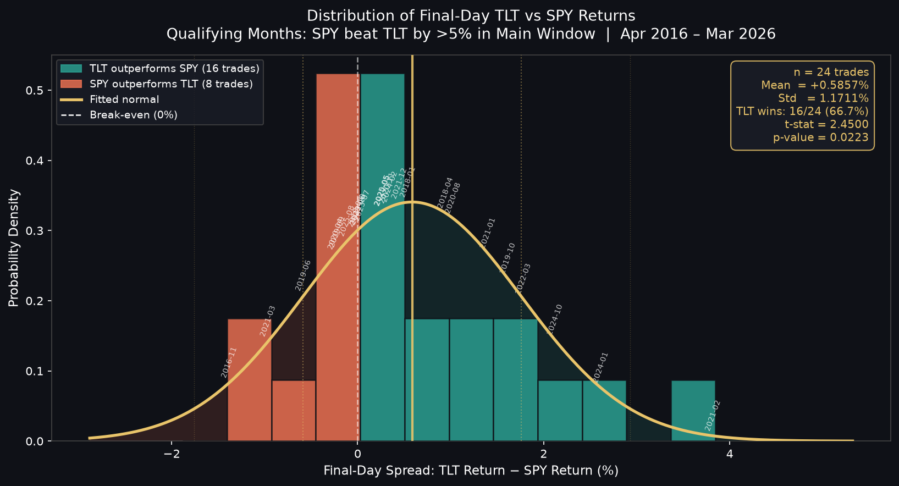
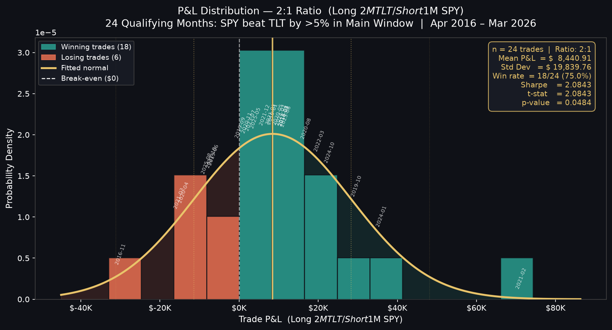

# spy-tlt-rebalancing

A backtest of a SPY/TLT mean-reversion strategy on the last trading day of the month.

## Hypothesis

Pension and insurance company rebalancing at month-end meaningfully impacts the relative performance of stocks vs bonds. When SPY outperforms TLT by more than 5% during the main window (first to second-to-last trading day), TLT tends to mean-revert on the final day.

**Trade:** Long $2M TLT, Short $1M SPY on the last trading day of the qualifying month.

**Data:** SPY and TLT daily closes, April 2016 – March 2026 (2,514 trading days, 120 complete months)

## Return Distribution



The chart shows the spread (TLT return − SPY return) on the final trading day across all 24 qualifying months. Green bars are months where TLT outperformed SPY (strategy wins); red bars are losses. The fitted normal curve is centred at +0.59%, shifted right of zero, confirming the mean-reversion effect. The p-value of 0.0223 confirms the rightward shift is statistically significant.

## Statistical Results

| Metric | Value |
|---|---|
| Qualifying months (SPY beat TLT by >5%) | 24 / 120 |
| Avg final-day SPY return | −0.3273% |
| Avg final-day TLT return | +0.2584% |
| Avg final-day SPY − TLT spread | −0.5857% |
| Median final-day SPY − TLT spread | −0.2932% |
| SPY underperformed TLT on final day | 16 / 24 (66.7%) |
| t-stat | −2.4500 |
| p-value | 0.0223 |

## Trade P&L

| Metric | Value |
|---|---|
| Total P&L | $202,585.31 |
| Average P&L per trade | $8,441.05 |
| Median P&L | $8,202.15 |
| Winning trades | 18 / 24 (75.0%) |
| Losing trades | 6 / 24 (25.0%) |
| Best trade | Feb 2021 (+$71,271.60) |
| Worst trade | Nov 2016 (−$30,002.35) |

## P&L Distribution



The chart shows the dollar P&L for each of the 24 qualifying trades at the 2:1 ratio (Long $2M TLT / Short $1M SPY). Green bars are winning trades (18 of 24, 75%); red bars are losing trades (6 of 24). The fitted normal curve is centred at +$8,441 — well to the right of break-even — with a Sharpe of 2.08 confirming the distribution is not centred at zero (p=0.048). The long right tail (Feb 2021, +$71K) reflects the largest single rebalancing event in the dataset.

## Trade-by-Trade Breakdown

| Month | Trade Window | SPY Final (%) | TLT Final (%) | P&L |
|---|---|---|---|---|
| 2016-11 | 2016-11-29 → 2016-11-30 | −0.2399% | −1.6201% | −$30,002.35 |
| 2018-01 | 2018-01-30 → 2018-01-31 | +0.0497% | +0.5901% | +$11,305.41 |
| 2018-04 | 2018-04-27 → 2018-04-30 | −0.7691% | +0.1766% | +$11,223.63 |
| 2019-01 | 2019-01-30 → 2019-01-31 | +0.8782% | +0.8600% | +$8,416.73 |
| 2019-06 | 2019-06-27 → 2019-06-28 | +0.5145% | −0.0678% | −$6,500.62 |
| 2019-09 | 2019-09-27 → 2019-09-30 | +0.4637% | +0.2452% | +$267.00 |
| 2019-10 | 2019-10-30 → 2019-10-31 | −0.2663% | +1.3490% | +$29,643.44 |
| 2020-04 | 2020-04-29 → 2020-04-30 | −0.9311% | −1.1677% | −$14,042.42 |
| 2020-05 | 2020-05-28 → 2020-05-29 | +0.4456% | +0.7142% | +$9,827.14 |
| 2020-08 | 2020-08-28 → 2020-08-31 | −0.3623% | +0.6641% | +$16,904.58 |
| 2020-11 | 2020-11-27 → 2020-11-30 | −0.4427% | −0.1248% | +$1,930.58 |
| 2021-01 | 2021-01-28 → 2021-01-29 | −2.0020% | −0.6016% | +$7,987.58 |
| 2021-02 | 2021-02-25 → 2021-02-26 | −0.5153% | +3.3059% | +$71,271.60 |
| 2021-03 | 2021-03-30 → 2021-03-31 | +0.4053% | −0.5580% | −$15,212.48 |
| 2021-12 | 2021-12-30 → 2021-12-31 | −0.2520% | +0.1961% | +$6,442.23 |
| 2022-03 | 2022-03-30 → 2022-03-31 | −1.5391% | +0.2429% | +$20,248.55 |
| 2022-10 | 2022-10-28 → 2022-10-31 | −0.7223% | −0.7128% | −$7,033.70 |
| 2023-06 | 2023-06-29 → 2023-06-30 | +1.1801% | +1.1795% | +$11,789.47 |
| 2023-07 | 2023-07-28 → 2023-07-31 | +0.1904% | +0.2404% | +$2,904.79 |
| 2024-01 | 2024-01-30 → 2024-01-31 | −1.6317% | +0.9820% | +$35,957.67 |
| 2024-02 | 2024-02-28 → 2024-02-29 | +0.3595% | +0.7057% | +$10,519.91 |
| 2024-10 | 2024-10-30 → 2024-10-31 | −1.9603% | +0.1625% | +$22,853.19 |
| 2025-05 | 2025-05-29 → 2025-05-30 | −0.1119% | +0.1509% | +$4,136.80 |
| 2025-08 | 2025-08-28 → 2025-08-29 | −0.5964% | −0.7109% | −$8,253.42 |

## Next-Day Bounce Analysis

After a qualifying month where SPY also had a negative final day, does SPY bounce back the next trading day?

**Filter:** SPY beat TLT by ≥5% in main window AND SPY final-day return was negative (15 cases)

| Metric | Value |
|---|---|
| Number of cases | 15 |
| Avg next-day SPY return | +0.4128% |
| Median next-day SPY return | +0.5633% |
| Positive next-day returns | 11 / 15 (73%) |
| Negative next-day returns | 4 / 15 (27%) |

## Sharpe Ratio

| Metric | Value |
|---|---|
| Mean P&L | $8,441.05 |
| Std Dev | $19,840.06 |
| N (trades) | 24 |
| Sharpe Ratio | 2.0843 |

A Sharpe of 2.08 shows the strategy generates strong risk-adjusted returns. For every dollar of volatility, the strategy earns roughly 2 dollars of average profit.

## Usage

**Notebook:** Open `spy_tlt_analysis.ipynb` in Jupyter and run cells in order.

**Script:** Run `spy_tlt_rebalancing.py` directly to fetch data, run all sections, and print results to the terminal.

```
pip install yfinance pandas scipy
python spy_tlt_rebalancing.py
```

## Caveats

- No transaction costs or slippage are modeled
- Position sizes are fixed at $2M long TLT / $1M short SPY

## Directions for a New Strategy

### 1. Capture the SPY Next-Day Bounce
Section 6 already researches this but does not trade it. After a qualifying month where SPY also had a negative final day, SPY bounces the next trading day 73% of the time (+0.41% avg). Add a second leg: Long SPY on the first trading day of the new month whenever the prior qualifying month had a negative final-day SPY return.

### 2. Symmetric Trade (TLT Beat SPY by >5%)
Test the reverse hypothesis: when TLT outperforms SPY by more than 5% during the main window, does SPY mean-revert upward on the last trading day? If confirmed, add a Long SPY / Short TLT trade for those months.

### 3. Quarter-End Amplification
Quarter-end rebalancing pressure (March, June, September, December) is structurally larger than regular month-end flows. Filter qualifying months to quarter-end only and test whether the effect size, win rate, and Sharpe improve meaningfully.

### 4. Adjustable Threshold and Regime Filter
Optimize the 5% spread threshold rather than treating it as fixed. Additionally, layer in a macro regime filter — such as VIX level or yield-curve slope — to avoid entering trades during trending or crisis environments where mean-reversion is less reliable.

### 5. Extend to Other Pairs
Apply the same month-end rebalancing hypothesis to other equity/bond pairs: QQQ/TLT (tech-heavy equity vs. long bonds), IWM/AGG (small-cap vs. broad bonds), or international equity/bond pairs. Compare signal frequency, effect size, and correlation to the SPY/TLT strategy.

---

## Strategy 1 Results: SPY Next-Day Bounce

**File:** `strategy_spy_bounce.py`

After a qualifying month where SPY *also* sold off on the final day, SPY bounces the next trading day. This converts the Section 6 observation into a tradeable second leg.

**Signal:** SPY beat TLT by >5% in main window AND SPY final-day return was negative (15 of 24 qualifying months)

**Trade:** Long $1M SPY — entry at last-day close, exit at first trading day of next month close

### Bounce Trade Summary

| Metric | Value |
|---|---|
| Total trades | 15 |
| Total P&L | $61,911.82 |
| Average P&L per trade | $4,127.45 |
| Median P&L | $5,633.03 |
| Winning trades | 11 / 15 (73.3%) |
| Losing trades | 4 / 15 (26.7%) |
| Best trade | Feb 2021 (+$24,240.11) |
| Worst trade | Apr 2020 (-$26,473.57) |
| Sharpe Ratio | 1.3520 |
| p-value | 0.1978 |

### Bounce Trade-by-Trade Breakdown

| Month | Entry Date | Exit Date | SPY Return (%) | P&L |
|---|---|---|---|---|
| 2016-11 | 2016-11-30 | 2016-12-01 | -0.3676% | -$3,675.70 |
| 2018-04 | 2018-04-30 | 2018-05-01 | +0.1776% | +$1,776.45 |
| 2019-10 | 2019-10-31 | 2019-11-01 | +0.9264% | +$9,263.69 |
| 2020-04 | 2020-04-30 | 2020-05-01 | -2.6474% | -$26,473.57 |
| 2020-08 | 2020-08-31 | 2020-09-01 | +0.9419% | +$9,418.59 |
| 2020-11 | 2020-11-30 | 2020-12-01 | +1.0937% | +$10,937.38 |
| 2021-01 | 2021-01-29 | 2021-02-01 | +1.6645% | +$16,645.41 |
| 2021-02 | 2021-02-26 | 2021-03-01 | +2.4240% | +$24,240.11 |
| 2021-12 | 2021-12-31 | 2022-01-03 | +0.5790% | +$5,789.95 |
| 2022-03 | 2022-03-31 | 2022-04-01 | +0.2834% | +$2,834.29 |
| 2022-10 | 2022-10-31 | 2022-11-01 | -0.4376% | -$4,376.15 |
| 2024-01 | 2024-01-31 | 2024-02-01 | +1.3088% | +$13,088.11 |
| 2024-10 | 2024-10-31 | 2024-11-01 | +0.4220% | +$4,220.48 |
| 2025-05 | 2025-05-30 | 2025-06-02 | +0.5633% | +$5,633.03 |
| 2025-08 | 2025-08-29 | 2025-09-02 | -0.7410% | -$7,410.25 |

### Combined P&L (Original + Bounce, Overlapping Months)

When both legs are stacked on the same 15 qualifying months:

| Metric | Value |
|---|---|
| Original leg total P&L | $169,266.57 |
| Bounce leg total P&L | $61,911.82 |
| Combined total P&L | $231,178.39 |
| Combined Sharpe Ratio | 1.7782 |

### Conclusion

The bounce effect is real and directionally consistent (73% win rate, +$62K total P&L) but does **not** reach statistical significance (p=0.198) with only 15 trades. Stacking the bounce leg on the same qualifying months adds $62K, bringing the combined total to $231K. However, the two legs are positively correlated on losers (e.g. Apr 2020 hurts both simultaneously), which pulls the combined Sharpe down to 1.78 from the standalone original strategy's 2.08. Best treated as a supplementary leg rather than a standalone strategy until more observations accumulate.

---

## Strategy 2 Results: Symmetric Trade (TLT Dominant)

**File:** `strategy_symmetric_tlt.py`

Tests whether the reverse signal — TLT outperforming SPY by >5% in the main window — produces a predictable SPY mean-reversion upward on the final trading day.

**Signal:** TLT beat SPY by >5% from first to second-to-last trading day of the month (12 / 120 months)

**Trade:** Long $2M SPY / Short $1M TLT on the last trading day

### Symmetric Trade Summary

| Metric | Value |
|---|---|
| Total trades | 12 |
| Total P&L | $53,207.29 |
| Average P&L per trade | $4,433.94 |
| Median P&L | $13,638.76 |
| Winning trades | 7 / 12 (58.3%) |
| Losing trades | 5 / 12 (41.7%) |
| Best trade | Jan 2022 (+$41,192.94) |
| Worst trade | May 2019 (-$39,470.14) |
| Sharpe Ratio | 0.5963 |
| p-value | 0.8540 |

### Symmetric Trade-by-Trade Breakdown

| Month | Trade Window | SPY Final (%) | TLT Final (%) | P&L |
|---|---|---|---|---|
| 2016-06 | 2016-06-29 -> 2016-06-30 | +1.3646% | +0.3685% | +$23,605.65 |
| 2018-10 | 2018-10-30 -> 2018-10-31 | +1.0681% | -0.5080% | +$26,442.51 |
| 2018-12 | 2018-12-28 -> 2018-12-31 | +0.8759% | +0.3800% | +$13,717.85 |
| 2019-03 | 2019-03-28 -> 2019-03-29 | +0.6306% | -0.0949% | +$13,559.66 |
| 2019-05 | 2019-05-30 -> 2019-05-31 | -1.3476% | +1.2519% | -$39,470.14 |
| 2019-08 | 2019-08-29 -> 2019-08-30 | -0.0444% | +0.0271% | -$1,159.98 |
| 2020-02 | 2020-02-27 -> 2020-02-28 | -0.4201% | +2.2583% | -$30,985.48 |
| 2020-03 | 2020-03-30 -> 2020-03-31 | -1.4905% | -0.8117% | -$21,693.92 |
| 2020-09 | 2020-09-29 -> 2020-09-30 | +0.7582% | -0.9585% | +$24,749.66 |
| 2022-01 | 2022-01-28 -> 2022-01-31 | +1.8011% | -0.5170% | +$41,192.94 |
| 2025-02 | 2025-02-27 -> 2025-02-28 | +1.5605% | +1.2266% | +$18,945.33 |
| 2026-02 | 2026-02-26 -> 2026-02-27 | -0.4802% | +0.6093% | -$15,696.79 |

### Strategy Comparison

| Metric | Original (SPY dominant) | Symmetric (TLT dominant) |
|---|---|---|
| Qualifying months | 24 / 120 | 12 / 120 |
| Winning trades | 18 / 24 (75.0%) | 7 / 12 (58.3%) |
| Total P&L | $202,585.31 | $53,207.29 |
| Avg P&L per trade | $8,441.05 | $4,433.94 |
| Sharpe Ratio | 2.0843 | 0.5963 |
| t-stat | -2.4500 | +0.1884 |
| p-value | 0.0223 | 0.8540 |

### Conclusion

The symmetric trade does **not** hold. The effect is statistically indistinguishable from noise (p=0.854), the win rate drops from 75% to 58%, and the Sharpe collapses from 2.08 to 0.60. Three structural reasons explain the asymmetry:

1. **One-directional rebalancing flows** — pension funds rebalance predictably *into* bonds after equity rallies, but the reverse (rebalancing into equities after bond rallies) is less mechanically consistent.
2. **Crisis contamination** — TLT-dominant months cluster around equity sell-offs (2018-12, 2020-02/03) where panic and momentum overwhelm any mean-reversion effect.
3. **High variance, low edge** — the best and worst trades are nearly equal in magnitude (~$40K), leaving near-zero average edge per trade.

---

## Optimal Position Sizing Analysis

**File:** `strategy_optimal_ratio.py`

The original 2:1 sizing (Long $2M TLT / Short $1M SPY) was a rule-of-thumb based on typical daily volatility. This analysis asks whether it is actually optimal, and if not, what the right ratio is.

### Why 2:1 Was Chosen (and Why It Is Wrong)

The 2:1 ratio is a **volatility-parity construction**: SPY's typical daily vol (~1%) is roughly twice TLT's (~0.5%), so doubling the TLT notional equalises dollar-risk on both legs. This is standard pairs-trading convention.

However, on the **specific qualifying final days** the volatility picture is different:

| Asset | Typical daily vol | Vol on qualifying final days |
|---|---|---|
| SPY | ~1.0% | 0.8321% |
| TLT | ~0.5% | **0.9581%** |

TLT is actually *more* volatile than SPY on these days because the rebalancing effect creates large bond moves. The vol-parity ratio on qualifying days is therefore SPY_vol / TLT_vol = 0.8321 / 0.9581 = **0.87x**, implying Long $870K TLT / Short $1M SPY — not $2M.

### Sharpe-Optimal Ratio vs Maximum P&L

Fixing SPY short at $1M and scanning TLT long from $0 to $5M:

| Ratio | TLT Notional | Total P&L | Avg P&L | Win Rate | Sharpe |
|---|---|---|---|---|---|
| 0.67x | $670K | $120K | $5,004 | 70.8% | **2.5211** ← Sharpe-optimal |
| 0.75x | $750K | $125K | $5,211 | 70.8% | 2.5157 |
| 0.87x | $870K | $133K | $5,521 | 66.7% | 2.4911 ← vol-parity (qualifying days) |
| 1.00x | $1M | $141K | $5,857 | 66.7% | 2.4500 |
| 1.25x | $1.25M | $156K | $6,503 | 70.8% | 2.3530 |
| 1.50x | $1.5M | $172K | $7,149 | 70.8% | 2.2539 |
| **2.00x** | **$2M** | **$203K** | **$8,441** | **75.0%** | **2.0843** ← current |
| 3.00x | $3M | $265K | $11,025 | 75.0% | 1.8617 |
| 5.00x | $5M | $389K | $16,193 | 66.7% | 1.6497 |

**The Sharpe-optimal ratio (0.67x) and the maximum P&L direction are opposite ends of the same trade-off.** Sharpe is maximised at low TLT notional because a smaller TLT leg reduces variance faster than it reduces expected return. Total P&L grows indefinitely with TLT notional because the average TLT final-day return (+0.26%) and average SPY final-day return (−0.33%) both contribute positively — more TLT always adds expected P&L, but at the cost of increasing variance and lowering Sharpe.

### Why Win Rate Is Not Monotonic

Win rate jumps at specific ratios rather than moving smoothly. Every trade has a **crossover ratio** — the exact TLT:SPY ratio at which that trade's P&L flips sign:

```
P&L = ratio × TLT_return − SPY_return = 0
         →  crossover = SPY_return / TLT_return
```

Four trade types exist:

| Type | Condition | Behaviour |
|---|---|---|
| Always Win | SPY < 0 and TLT > 0 | Both legs help at any ratio |
| Always Loss | SPY > 0 and TLT < 0 | Both legs hurt at any ratio |
| Win above crossover | SPY > 0 and TLT > 0 | Needs enough TLT weight to overcome positive SPY |
| Loss above crossover | SPY < 0 and TLT < 0 | SPY helps but TLT drag eventually dominates |

Across the 24 qualifying trades: 9 are Always Win, 2 are Always Loss, and 13 have a crossover ratio somewhere between 0.08x and 3.55x. As the ratio increases, trades flip one by one, causing the win count to step up or down at each crossover point.

### Why 2:1 Has the Highest Win Rate

Exactly **4 trades** flip between the 0.87x and 2.00x ratios:

| Month | At 0.87:1 | At 2.00:1 | Crossover | Reason |
|---|---|---|---|---|
| 2019-01 | LOSS | WIN | 1.021x | SPY=+0.88%, TLT=+0.86% — TLT just below SPY, needs ratio >1.02 to win |
| 2019-09 | LOSS | WIN | 1.891x | SPY=+0.46%, TLT=+0.25% — TLT much smaller, needs ratio >1.89 to win |
| 2023-06 | LOSS | WIN | 1.001x | SPY=+1.18%, TLT=+1.18% — nearly identical returns, crossover just above 1.0 |
| 2022-10 | WIN | LOSS | 1.013x | SPY=−0.72%, TLT=−0.71% — both negative and nearly equal; TLT drag exceeds SPY benefit above 1.01x |

Net: +3 wins and −1 loss going from 0.87x to 2.00x = **+2 net wins**
→ 16/24 (66.7%) at 0.87x becomes 18/24 (75.0%) at 2.00x

The 2:1 ratio captures three months (2019-01, 2019-09, 2023-06) where both assets finished positive but TLT needed amplification to carry the trade. At 0.87:1 those months aren't worth enough TLT to overcome the SPY headwind. The one trade lost at 2:1 (2022-10) is a near-wash month where both assets fell by almost the same amount.

### Conclusion

There is no single "optimal" ratio — the answer depends on what you are optimising:

| Objective | Optimal Ratio | TLT Notional | Sharpe | Total P&L |
|---|---|---|---|---|
| Maximise Sharpe | 0.67x | $670K | 2.52 | $120K |
| Vol-parity (qualifying days) | 0.87x | $870K | 2.49 | $133K |
| Maximise win rate | ~2.0x–3.3x | $2M–$3.3M | 2.08–1.86 | $203K–$265K |
| Maximise total P&L | Unbounded ↑ | Higher = more | Declining | Higher = more |

The current 2:1 is a reasonable compromise: it sits near the peak of the win-rate range and generates strong absolute P&L, at the cost of ~0.44 Sharpe points versus the mathematical optimum. Practitioners who care more about number of winning months than risk-adjusted efficiency will prefer it; those running this as part of a larger portfolio should consider the Sharpe-optimal 0.67x.
